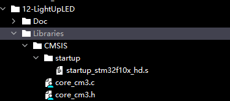

# A. Add hex file

We need to add `startup_stm32f10x_hd.s` to the project according to the models of micro-controllers. This file is
written in assembly language which is used to set up the memory pointer and system clock etc. It is a configuration file
of STM32.

## B. Model References

| Hex File               | Differences                                                          |
|------------------------|----------------------------------------------------------------------|
| startup_stm32f10x_ld.s | ld: low-density, capacity of flash ranging from 16 to 32 K    |
| startup_stm32f10x_md.s | md: medium-density, capacity of flash ranging from 16 to 32 K    |
| startup_stm32f10x_hd.s | hd: high-density, capacity of flash ranging from 256 to 512 K  |
| startup_stm32f10x_xl.s | xl: extra high density, capacity of flash ranging from 512 to 1024 K |

For more details, please find
the [reference on official website](https://www.st.com/en/microcontrollers-microprocessors/stm32f103.html#tools-software)

## C. Add hex file to the project

You can put the `startup` file under `CMSIS/startup` folder of STM32 project based on your MCU model. In this
repository, I will use STM32f103ve to build most of example projects. The name of the startup file will
be `startup_stm32f10x_hd.s`

## D. Reminder

Don't worry about this part, you can use a software named `CubeMX` to generate `hex` file automatically or you can find
the files in other developers' github repositories