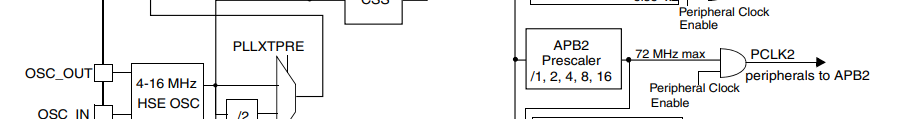
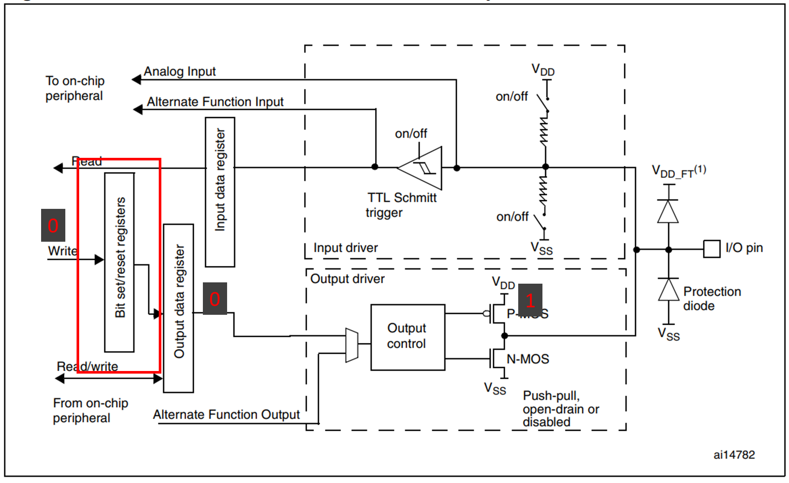
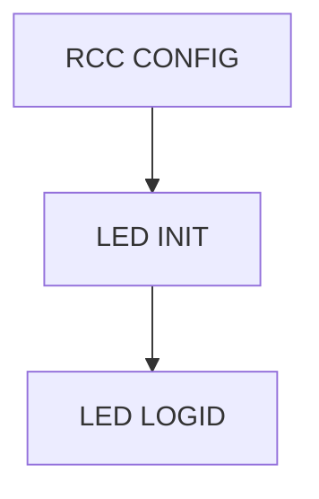

# A. Project Structure

A STM32 project is composed of 3 folders including `Libraries`, `Project` and `User`.

## A1. Libraries

Libraries folder contains the peripheral drivers of STM32 MCU. You shouldn't modify the files during development, but
you can a lot of useful information from the files.

## A2. Project

The project folder belongs to the IDE, it contains the configurations of the project. You can use IDE to modify the
configurations.

## A3. User

You can put your source code in this folder such as interrupt handlers, main function and other functions.

# B. Build your first LED blinking project

Under the `User` folder, create a new folder named `led` and create 2 files named `bsp_led.h` and `bsp_led.c` in the
folder. "bsp" means "board support package".

## B1. bsp_led.h

```c
#ifndef BSP_LED_H
#define BSP_LED_H
#include "stm32f10x.h"
#define ON	1
#define OFF 0
#define LED_G_LIGHT(a)	if(a)GPIO_ResetBits(GPIOB,GPIO_Pin_0);else GPIO_SetBits(GPIOB,GPIO_Pin_0);
void 	LED_G_Init_CLK();
void	LED_G_Init();

#endif
```

Statements:

- `#include "stm32f10x.h"`: include the header file of STM32F10x series, it will load the default drivers automatically.
- `#define ON 1` and `#define OFF 0`: define the macro of LED status.
- `LED_G_LIGHT(a)`: define the macro of LED control function.
- `void LED_G_Init_CLK();`: declare the function of LED clock initialization.
- `void	LED_G_Init();`: declare the function of LED initialization.

Exaplainations:
Some variables and functions are defined in `Libraries` of project, for example, you can find GPIOB in `stm32f10x.h`:

```c
#define GPIOB               ((GPIO_TypeDef *) GPIOB_BASE)
```

You can also find GPIOB_BASE in `stm32f10x.h`:

```c
#define GPIOB_BASE            (APB2PERIPH_BASE + 0x0C00)
```

GPIOB_BASE is the memory address of GPIOB. After calculation, we know the memeory address of GPIOB is 0x40010C00, and
GPIOB_pin0 is 0x40010C00 + 0x00 = 0x40010C00.

## B2. bsp_led.c

```c
#include "bsp_led.h"
// initialize APB2_CLK

void LED_G_Init_CLK(){
	RCC_APB2PeriphClockCmd(RCC_APB2Periph_GPIOB, ENABLE);
}

void LED_G_Init(){
	GPIO_InitTypeDef LED_G;
	LED_G.GPIO_Pin = GPIO_Pin_0;
	LED_G.GPIO_Mode = GPIO_Mode_Out_PP;
	LED_G.GPIO_Speed = GPIO_Speed_50MHz;
	GPIO_Init(GPIOB, &LED_G);
}
```

### B2.1 Clock of GPIOB

`RCC_APB2PeriphClockCmd(RCC_APB2Periph_GPIOB, ENABLE)`: enable the clock of GPIOB, you can find APC2 in the graph below.
If don't the set the prescaler of APC2 manually, the frequency of APC2 is 72MHz.


Reference Code:

```c
/**
  * @brief  Enables or disables the High Speed APB (APB2) peripheral clock.
  * @param  RCC_APB2Periph: specifies the APB2 peripheral to gates its clock.
  *   This parameter can be any combination of the following values:
  *     @arg RCC_APB2Periph_AFIO, RCC_APB2Periph_GPIOA, RCC_APB2Periph_GPIOB,
  *          RCC_APB2Periph_GPIOC, RCC_APB2Periph_GPIOD, RCC_APB2Periph_GPIOE,
  *          RCC_APB2Periph_GPIOF, RCC_APB2Periph_GPIOG, RCC_APB2Periph_ADC1,
  *          RCC_APB2Periph_ADC2, RCC_APB2Periph_TIM1, RCC_APB2Periph_SPI1,
  *          RCC_APB2Periph_TIM8, RCC_APB2Periph_USART1, RCC_APB2Periph_ADC3,
  *          RCC_APB2Periph_TIM15, RCC_APB2Periph_TIM16, RCC_APB2Periph_TIM17,
  *          RCC_APB2Periph_TIM9, RCC_APB2Periph_TIM10, RCC_APB2Periph_TIM11     
  * @param  NewState: new state of the specified peripheral clock.
  *   This parameter can be: ENABLE or DISABLE.
  * @retval None
  */
void RCC_APB2PeriphClockCmd(uint32_t RCC_APB2Periph, FunctionalState NewState)
{
  /* Check the parameters */
  assert_param(IS_RCC_APB2_PERIPH(RCC_APB2Periph));
  assert_param(IS_FUNCTIONAL_STATE(NewState));
  if (NewState != DISABLE)
  {
    RCC->APB2ENR |= RCC_APB2Periph;
  }
  else
  {
    RCC->APB2ENR &= ~RCC_APB2Periph;
  }
}
```

### B2.2 Initialize GPIOB

```c
void LED_G_Init(){
	GPIO_InitTypeDef LED_G;
	LED_G.GPIO_Pin = GPIO_Pin_0;
	LED_G.GPIO_Mode = GPIO_Mode_Out_PP;
	LED_G.GPIO_Speed = GPIO_Speed_50MHz;
	GPIO_Init(GPIOB, &LED_G);
}
```

`GPIO_Init(GPIOB, &LED_G)`: `LED_D` is a structure of GPIO initialization.

Reference Code:

```c
/**
  * @brief  Initializes the GPIOx peripheral according to the specified
  *         parameters in the GPIO_InitStruct.
  * @param  GPIOx: where x can be (A..G) to select the GPIO peripheral.
  * @param  GPIO_InitStruct: pointer to a GPIO_InitTypeDef structure that
  *         contains the configuration information for the specified GPIO peripheral.
  * @retval None
  */
void GPIO_Init(GPIO_TypeDef* GPIOx, GPIO_InitTypeDef* GPIO_InitStruct)
{
  uint32_t currentmode = 0x00, currentpin = 0x00, pinpos = 0x00, pos = 0x00;
  uint32_t tmpreg = 0x00, pinmask = 0x00;
  /* Check the parameters */
  assert_param(IS_GPIO_ALL_PERIPH(GPIOx));
  assert_param(IS_GPIO_MODE(GPIO_InitStruct->GPIO_Mode));
  assert_param(IS_GPIO_PIN(GPIO_InitStruct->GPIO_Pin));  
  
/*---------------------------- GPIO Mode Configuration -----------------------*/
  currentmode = ((uint32_t)GPIO_InitStruct->GPIO_Mode) & ((uint32_t)0x0F);
  if ((((uint32_t)GPIO_InitStruct->GPIO_Mode) & ((uint32_t)0x10)) != 0x00)
  { 
    /* Check the parameters */
    assert_param(IS_GPIO_SPEED(GPIO_InitStruct->GPIO_Speed));
    /* Output mode */
    currentmode |= (uint32_t)GPIO_InitStruct->GPIO_Speed;
  }
```

# C. Main function

## C1. main.c

```c
#include "stm32f10x.h"
#include "bsp_led.h"

void Delay(uint32_t num){
	for(;num!=0;num--){}
}

int main(void){
	LED_G_Init_CLK();
	LED_G_Init();
	while(1){
		LED_G_LIGHT(ON);
		Delay(1000000);
		LED_G_LIGHT(OFF);
		Delay(1000000);
	}
}
```

After calling `LED_G_Init_CLK()` and `LED_G_Init()`, we can use `LED_G_LIGHT(ON)` and `LED_G_LIGHT(OFF)` to control the
LED.

LED_G_LIGHT({state}) is defined in bsp_led.h:

```c
#define LED_G_LIGHT(a)	\
if(a)GPIO_ResetBits(GPIOB,GPIO_Pin_0);\
else GPIO_SetBits(GPIOB,GPIO_Pin_0);
```

How to Turn on LED:


# D. General Workflow

The current gitbook doesn't support mermaid diagram. Please refer to the repository and find related `README` file to
see the chart.

