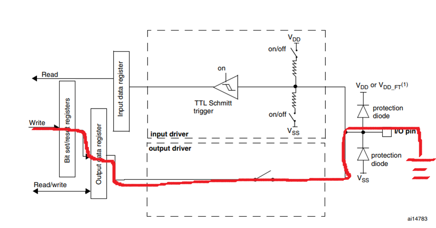
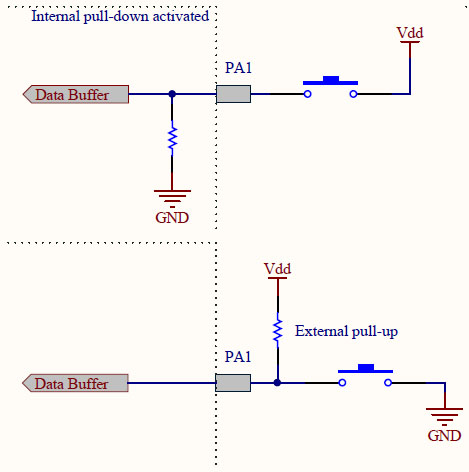
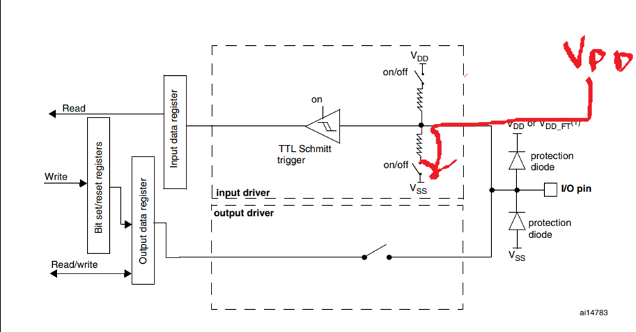
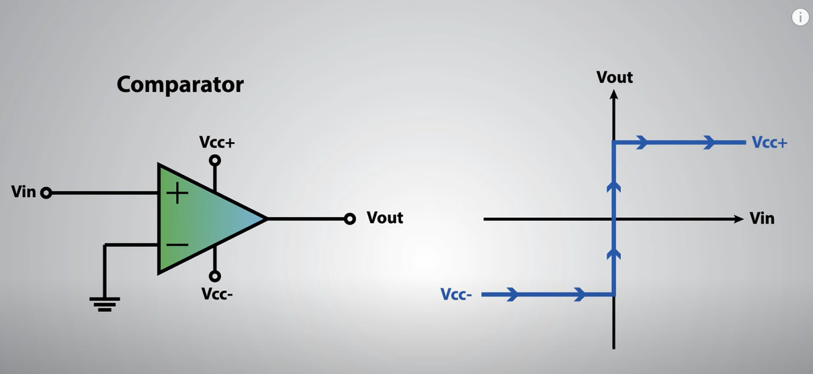

# A. Introduction

In this chapter, we are going to build a system to toggle the LED light bulb -- press the key to determine the state of
LED.

# B. Programming

## B1. `bsp_key.h`

```c
#ifndef BSP_KEY_H
#define BSP_KEY_H
#include "stm32f10x.h"

#define RCC_KeyPort	   RCC_APB2Periph_GPIOA
#define GPIO_KeyPort	 GPIOA
#define GPIO_KeyPin	   GPIO_Pin_0


void GPIOA_CLK_Config(void);// configuration of APB2_GPIOA_CLK
void Key_Config(void); // allow GPIOA_0 accees floating input
uint8_t KeyScan(GPIO_TypeDef* Port, uint16_t GPIO_Pin);
#endif
```

From previous chapter, we learn that we use the memory address of GPIOx + GPIO_Pin to access the GPIO port. In this
case, we will use GPIOA_Pin_0 to access the configurate the input of key. So the memory address of GPIOA is
`0x40010800`, and the memory address of GPIOA_Pin_0 is `0x40010800 + 0x00 = 0x40010800`.

## B2. `bsp_key.c`

### B2.1 Peripheral clock configuration (default 72MHz Configuration)

```c
void GPIOA_CLK_Config(){
	RCC_APB2PeriphClockCmd(RCC_KeyPort, ENABLE);
}
```

### B2.2 GPIO configuration

```c
void Key_Config(){
	GPIO_InitTypeDef Key;
	Key.GPIO_Pin = GPIO_KeyPin; # GPIO_Pin_0
	Key.GPIO_Mode = GPIO_Mode_IN_FLOATING; # floating input
	GPIO_Init(GPIO_KeyPort, &Key); # initialize GPIOA_0
}
```

What is floating input? Floating input means that the input is not connected to any voltage source. So the input will be
generate by the noise of the environment (chip itself). In this case, we will use the key to connect the input to the
ground to generate the input.

Different modes of GPIO:

```c
typedef enum
{ GPIO_Mode_AIN = 0x0,
  GPIO_Mode_IN_FLOATING = 0x04,
  GPIO_Mode_IPD = 0x28,
  GPIO_Mode_IPU = 0x48,
  GPIO_Mode_Out_OD = 0x14,
  GPIO_Mode_Out_PP = 0x10,
  GPIO_Mode_AF_OD = 0x1C,
  GPIO_Mode_AF_PP = 0x18
}GPIOMode_TypeDef;
```

Floating:
you should connect the input to the `ground` to generate the input. Look at the following picture to see what happen
when pressing the key:


Pull up & Pull down:



Example of Pull down circuit when pressing the key:


Floating VS Pull Up/Down:

Floating isn't a stable signal because it comes from the noise of the environment. Pull Up/Down is a stable signal

### B2.3 Key scan:

```c
uint8_t KeyScan(GPIO_TypeDef* Port, uint16_t GPIO_Pin){

    // may need to add some delay
    
	if(GPIO_ReadInputDataBit(Port, GPIO_Pin)==1){
		while(GPIO_ReadInputDataBit(Port, GPIO_Pin)==1){}
		return 1; //keypressed
	}else{
		return 0; // Not pressed
	}
}
```

`while(GPIO_ReadInputDataBit(Port, GPIO_Pin)==1){}`: if the key is pressed, the GPIOA_0 will be 1, so the while loop
will record the pressing state, otherwise, you will get so many `1` in this function. <mark>Usually, we may need to add
some delay in the while loop to prevent some circut problems. e.g. Reading unexpected 0</mark>

## B3. `main.c`

```c
#include "stm32f10x.h"
#include "bsp_led.h"
#include "bsp_key.h"

void Delay(uint32_t num){
	for(;num!=0;num--){}
}

int main(void){
	LED_G_Init_CLK();
	LED_G_Init();
	GPIOA_CLK_Config();
	Key_Config();
	while(1){
		if(KeyScan(GPIOA,GPIO_Pin_0)){
			LED_TOGGLE;
		}
	}
}
```

# C. Tips

Designing embedded system isn't difficult, but it highly depends on your experience and understanding. One of good
behavior to design embedded system is to test electronic components one by one and store the result in your mind. For
example, you can test the LED, key, buzzer, etc. one by one and save the codes in your computer or github. So when you
design the embedded system, you can easily find references!

# D. Extra Knowledge
TTL Schmitt Trigger:


Youtube Video Explanation: https://www.youtube.com/watch?v=Nrp8OgQLAlw
