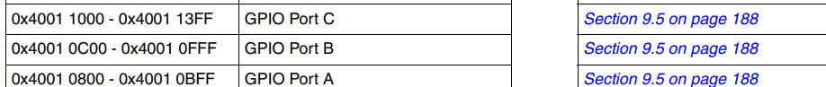
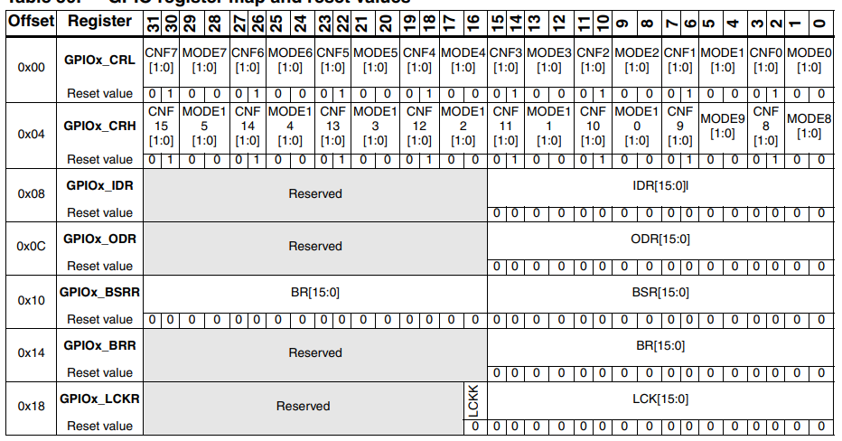
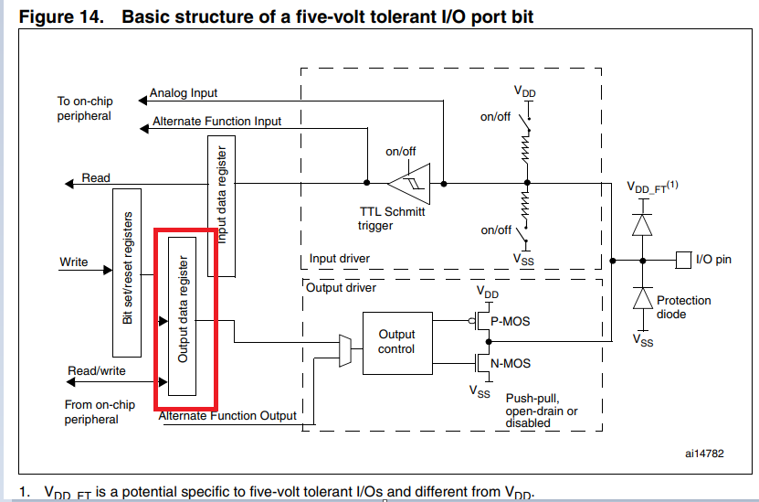
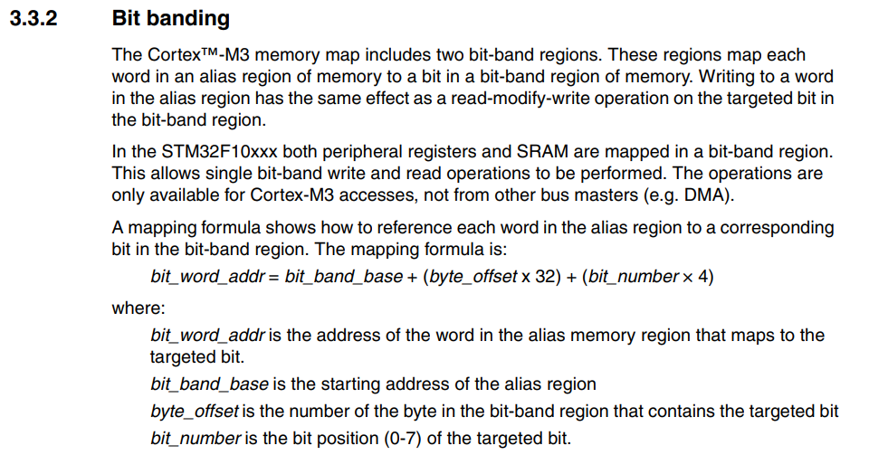
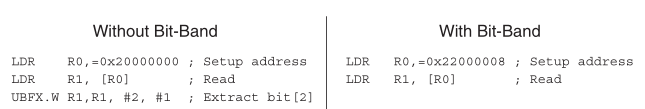

# A. Introduction

The coolest thing of STM32 development is to access registers directly. We can change some bits in registers to control
hardware peripherals.

<mark>Note: bitband is not very useful in your application design, but the concept is very important to design a chip.
You can either skip or read this chapter depending on your interests</mark>

# B. Codes

It is not easy to understand the concept of bit band, so read the following code carefully and remember the `BITBAND`
function.

```c
#include "stm32f10x.h"
#include "bsp_led.h"
#include "bsp_key.h"


#define GPIOB_ODR_ADDR (GPIOB_BASE+0x0C)
#define BITBAND(Addr, n) *(uint32_t*)((Addr & 0xF0000000)+0x02000000+((Addr & 0x00FFFFFF)<<5)+(n<<2))

void Delay(uint32_t num){
	for(;num!=0;num--){}
}

int main(void){

	LED_G_Init_CLK();
	LED_G_Init();

	while(1){
		BITBAND(GPIOB_ODR_ADDR, 0)=0;
		Delay(0xFFFFF);
		BITBAND(GPIOB_ODR_ADDR, 0)=1;
		Delay(0xFFFFF);
	}
}
```

Actually we define a parameter and a lambda function to access the register.

The function is defined as follows:

```c
#define GPIOB_ODR_ADDR (GPIOB_BASE+0x0C)

#define BITBAND(Addr, n) *(uint32_t*)((Addr & 0xF0000000)+0x02000000+((Addr & 0x00FFFFFF)<<5)+(n<<2))
```

# C. Bitband region and bitband alias region

You can control the LED output via either `bitband region` or `bitband alias region`.

## C1. Bitband Region

Refer to the STM32F103xx Reference Manual, we know that the base address of GPIOB is `0x40010C00`. The offset of ODR is
0x0C. So the address of GPIOB_ODR_ADDR is `0x40010C0C`, to access ODR of GPIOB.





`ODR` means output data register. Refer to the figure below, we can see that the `ODR` is a 32-bit register .



If you read the value of `0x40010C0C`, you will get `0xxxx0000`. If you write `0xxxxx0001` to `0x40010C0C`, you will
make the `ODR` of GPIOB to `1`. However, it is very hard to control the state because the address is too long. We have a
better method to change `ODR` value which is called `bitband alias`.

## C2. Bitband Alias Region



Bitband Base:

```text
Addr = 0x40010C0C 

Addr& 0xF0000000 = 0x40000000
```

```text
0x40000000 + 0x02000000 = 0x42000000
```

Bitband offset:

```text
Addr& 0x00FFFFFF = 0x00010C0C 0x00010C0C << 5 = 0x00286060
```

- `<<5` means `*32`

bit_number:

```text
n=0 n << 2 = 0x00000000
```

- `<<2` means `*4`

# D. Comparisons in binary code to read register status

It is very hard hard to read one bit value in `bitband region`, but you can easily use `bitband alias` to read target
register beacuse the result will only give you `0` or `1`.



# E. Reference

1. STM32F103xx Reference Manual, 3.2 Memory Organization, Page 49