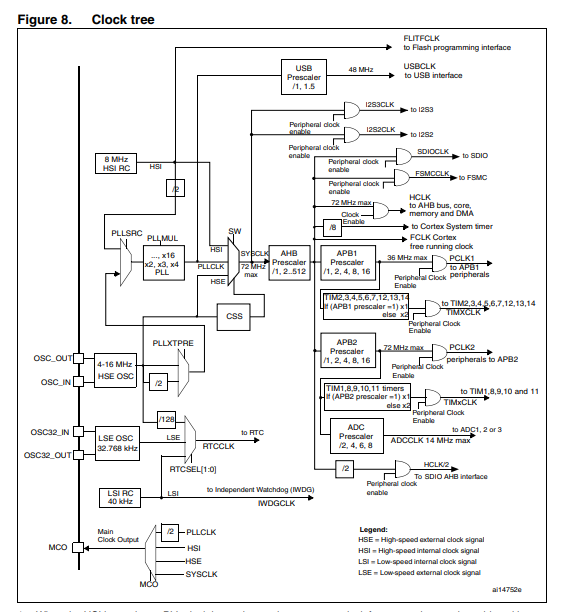
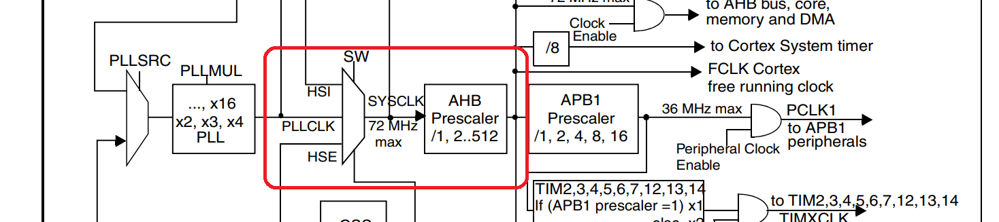
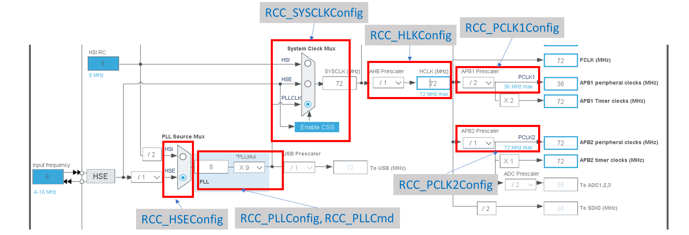
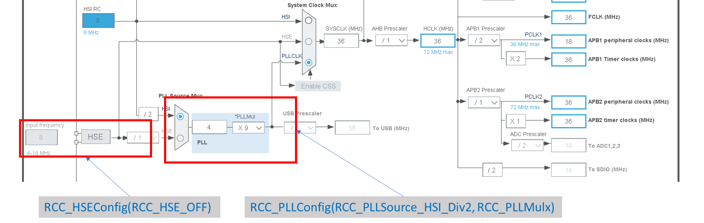

# A. Introduction

`RCC` stands for `Reset and Clock Control`. It is used to control the reset and clock of the chip. It is a very
important to control the output frequency of signals for different peripherals.

<mark>The CubeMX tool provides you a UI to configurate the clock frequency of MCU. If you are using CubeMX HAL to
develop the system, you can skip this chapter optionally.</mark>

# B. Theory

## B1. Clock Tree



## B2. Clock Source



- HSE: High Speed External Clock, it is generated by external crystal oscillator.
- HSI: High Speed Internal Clock, it is generated by internal RC oscillator.

## B3. More

You can find more information about RCC in the following documents (Inside STM32 Datasheet Folder):

- STM32-F10x Reference Manual, Page 90 - 95

# C. Codes

## C1. Configuration of HSE

Function to Chart:



Codes:

```c
void HSE_SetSysClk(uint32_t RCC_PLLMulx){
	//Reset the clock
	RCC_DeInit();
	RCC_HSEConfig(RCC_HSE_ON);
	if(RCC_WaitForHSEStartUp()==SUCCESS){
		FLASH_PrefetchBufferCmd(FLASH_PrefetchBuffer_Enable);
		FLASH_SetLatency(FLASH_Latency_2);
				
		RCC_PLLConfig(RCC_PLLSource_HSE_Div1, RCC_PLLMulx);
		RCC_PLLCmd(ENABLE);
		
		RCC_SYSCLKConfig(RCC_SYSCLKSource_PLLCLK);
		while(RCC_GetSYSCLKSource()!=0x08){}
		RCC_HCLKConfig(RCC_SYSCLK_Div1);
		RCC_PCLK1Config(RCC_HCLK_Div2);
		RCC_PCLK2Config(RCC_HCLK_Div1);
	}
	else{
		//RCC is not opened fail
	}
}
```

Code Explanation:

1. RCC_HSEConfig(RCC_HSE_ON): Enable the HSE clock. The default clock source becomes HSE.
2. RCC_PLLConfig(RCC_PLLSource_HSE_Div1, RCC_PLLMulx): Set the PLL source as HSE, and set the PLL multiplier.
3. RCC_PLLCmd(ENABLE): Enable the PLL.
4. RCC_SYSCLKConfig(RCC_SYSCLKSource_PLLCLK): Set the system clock source as PLL.
5. while(RCC_GetSYSCLKSource()!=0x08){}: Wait until the system clock source is set as PLL.
6. RCC_HCLKConfig(RCC_SYSCLK_Div1): Set the HCLK as system clock.
7. RCC_PCLK1Config(RCC_HCLK_Div2): Set the PCLK1 as HCLK/2.
8. RCC_PCLK2Config(RCC_HCLK_Div1): Set the PCLK2 as HCLK.

## C2. Configuration of HSI
Function to Chart:

Refer to previous codes, only modify some function in the codes.



Codes:

```c
void HSI_SetSysClk(uint32_t RCC_PLLMulx){
	//Reset the clock
	RCC_DeInit();
	RCC_HSEConfig(RCC_HSE_OFF);
	if(RCC_WaitForHSEStartUp()==SUCCESS){
		FLASH_PrefetchBufferCmd(FLASH_PrefetchBuffer_Enable);
		FLASH_SetLatency(FLASH_Latency_2);
				
		RCC_PLLConfig(RCC_PLLSource_HSI_Div2, RCC_PLLMulx);
		RCC_PLLCmd(ENABLE);
		
		RCC_SYSCLKConfig(RCC_SYSCLKSource_PLLCLK);
		while(RCC_GetSYSCLKSource()!=0x08){}
		RCC_HCLKConfig(RCC_SYSCLK_Div1);
		RCC_PCLK1Config(RCC_HCLK_Div2);
		RCC_PCLK2Config(RCC_HCLK_Div1);
	}
	else{
		//RCC is not opened fail
	}
}
```

Code Explanation:

1. RCC_HSEConfig(RCC_HSE_OFF): Disable the HSE clock. The default clock source becomes HSI.
2. RCC_PLLConfig(RCC_PLLSource_HSI_Div2, RCC_PLLMulx): Set the PLL source as HSI/2, and set the PLL multiplier.

