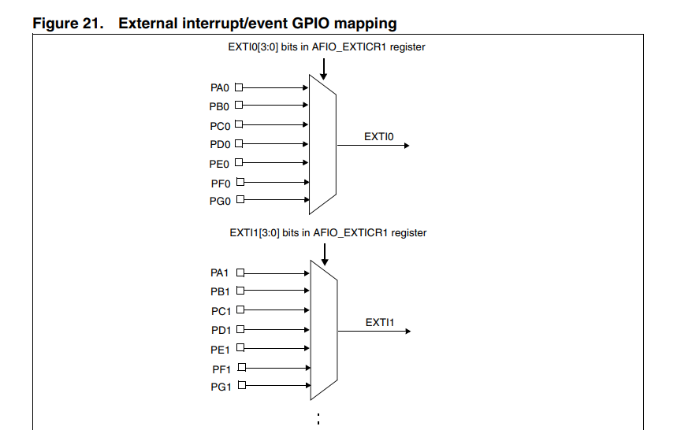

# A. Introduction

Before starting this chapter, I would like to ask you a question: How to receive signals from the other devices when
running some peripheral drivers? For example, you are asked to design a toy car, and you need to receive the bluetooth
singal from the remote controller.

To solve this problem, we can use short repetitive signals, interrupt or DMA to handle the receiver of the toy car. We
will introduce `DMA` in the future chapters, so, let us focus on `repetitive signals` and `interrupt`.

## A1. Repetitive signals

# B. Code Analysis

## B1. Interrupt Settings

Refer to `exti/bsp_exti.c`:

```c
void EXTI_Config(void){
	EXTI_InitTypeDef EXTIStructInit;
	EXTIStructInit.EXTI_Line = EXTI_Line0; // refer to GPIOA
	EXTIStructInit.EXTI_Mode = EXTI_Mode_Interrupt;
	EXTIStructInit.EXTI_Trigger = EXTI_Trigger_Rising;
	EXTIStructInit.EXTI_LineCmd = ENABLE;
	
	EXTI_Init(&EXTIStructInit);
}
```

### B1.1 EXTI_InitTypeDef

```c
typedef struct
{
  uint32_t EXTI_Line;               /*!< Specifies the EXTI lines to be enabled or disabled.
                                         This parameter can be any combination of @ref EXTI_Lines */
   
  EXTIMode_TypeDef EXTI_Mode;       /*!< Specifies the mode for the EXTI lines.
                                         This parameter can be a value of @ref EXTIMode_TypeDef */

  EXTITrigger_TypeDef EXTI_Trigger; /*!< Specifies the trigger signal active edge for the EXTI lines.
                                         This parameter can be a value of @ref EXTIMode_TypeDef */

  FunctionalState EXTI_LineCmd;     /*!< Specifies the new state of the selected EXTI lines.
                                         This parameter can be set either to ENABLE or DISABLE */ 
}EXTI_InitTypeDef;
```

EXTI_Line:

Refer to Reference Manual Page 201, you can find `External interrupt/event GPIO mapping` table. Actually the
IO `GIPOA_Pin0 ` we used in testing maps `EXTI0`,

so `EXTIStructInit.EXTI_Line = EXTI_Line0;`



EXTI_Mode:

To configure the EXTI line as interrupt or event, we can use `EXTI_Mode_Interrupt` or `EXTI_Mode_Event`. In this case,
we use `EXTI_Mode_Interrupt`.

```c
typedef enum
{
  EXTI_Mode_Interrupt = 0x00,
  EXTI_Mode_Event = 0x04
}EXTIMode_TypeDef;
```

EXTI_Trigger:

