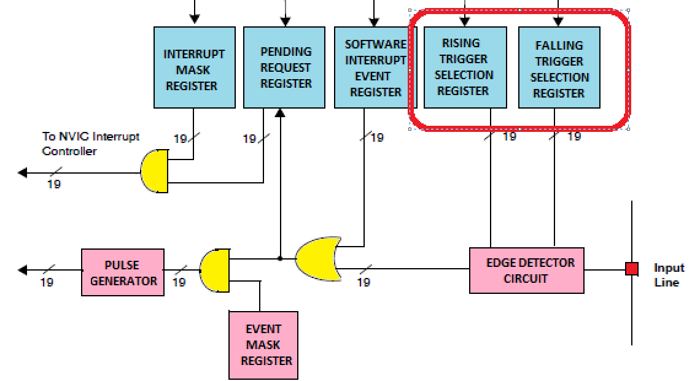

# A. Introduction

Before starting this chapter, I would like to ask you a question: How to receive signals from the other devices when
running some peripheral drivers? For example, you are asked to design a toy car, and you need to receive the bluetooth
singal from the remote controller.

To solve this problem, we can use short repetitive signals, interrupt or DMA to handle the receiver of the toy car. We
will introduce `DMA` in the future chapters, so, let us focus on `repetitive signals` and `interrupt`.

## A1. Repetitive signals

# B. Code Analysis

## B1. Interrupt Settings

Refer to `exti/bsp_exti.c`:

```c
void EXTI_Config(void){
	EXTI_InitTypeDef EXTIStructInit;
	EXTIStructInit.EXTI_Line = EXTI_Line0; // refer to GPIOA
	EXTIStructInit.EXTI_Mode = EXTI_Mode_Interrupt;
	EXTIStructInit.EXTI_Trigger = EXTI_Trigger_Rising;
	EXTIStructInit.EXTI_LineCmd = ENABLE;
	
	EXTI_Init(&EXTIStructInit);
}
```

### B1.1 EXTI_InitTypeDef

```c
typedef struct
{
  uint32_t EXTI_Line;               /*!< Specifies the EXTI lines to be enabled or disabled.
                                         This parameter can be any combination of @ref EXTI_Lines */
   
  EXTIMode_TypeDef EXTI_Mode;       /*!< Specifies the mode for the EXTI lines.
                                         This parameter can be a value of @ref EXTIMode_TypeDef */

  EXTITrigger_TypeDef EXTI_Trigger; /*!< Specifies the trigger signal active edge for the EXTI lines.
                                         This parameter can be a value of @ref EXTIMode_TypeDef */

  FunctionalState EXTI_LineCmd;     /*!< Specifies the new state of the selected EXTI lines.
                                         This parameter can be set either to ENABLE or DISABLE */ 
}EXTI_InitTypeDef;
```

EXTI_Line:

Refer to Reference Manual Page 201, you can find `External interrupt/event GPIO mapping` table. Actually the
IO `GIPOA_Pin0 ` we used in testing maps `EXTI0`,

so `EXTIStructInit.EXTI_Line = EXTI_Line0;`


EXTI_Mode:

To configure the EXTI line as interrupt or event, we can use `EXTI_Mode_Interrupt` or `EXTI_Mode_Event`. In this case,
we use `EXTI_Mode_Interrupt`.

```c
typedef enum
{
  EXTI_Mode_Interrupt = 0x00,
  EXTI_Mode_Event = 0x04
}EXTIMode_TypeDef;
```

EXTI_Trigger:

Interruption can be triggered by the rising edge, falling edge, or even both rising and falling edge of signal.

This is an example of rising edge:


Actually rising and falling registers are seperated into two parts, so we can call them together
by `EXTI_Trigger_Rising_Falling`.



Reference codes:

```c
typedef enum
{
  EXTI_Trigger_Rising = 0x08,
  EXTI_Trigger_Falling = 0x0C,  
  EXTI_Trigger_Rising_Falling = 0x10
}EXTITrigger_TypeDef;
```

## B2. NVIC Settings

Refer to `exti/bsp_exti.c`:

```c
void NVIC_Config(void){
	NVIC_PriorityGroupConfig(NVIC_PriorityGroup_1);
	NVIC_InitTypeDef NVICStuctInit;
	NVICStuctInit.NVIC_IRQChannel = EXTI0_IRQn;
	NVICStuctInit.NVIC_IRQChannelPreemptionPriority = 1;
	NVICStuctInit.NVIC_IRQChannelSubPriority = 1;
	NVICStuctInit.NVIC_IRQChannelCmd = ENABLE;
	NVIC_Init(&NVICStuctInit);
}
```

In this case we have 1 bit for pre-emption priority and 3 bits for subpriority.

### B2.1 NVIC_PriorityGroupConfig

```text
This parameter can be one of the following values:

@arg NVIC_PriorityGroup_0: 0 bits for pre-emption priority

4 bits for subpriority

@arg NVIC_PriorityGroup_1: 1 bits for pre-emption priority

3 bits for subpriority

@arg NVIC_PriorityGroup_2: 2 bits for pre-emption priority

2 bits for subpriority

@arg NVIC_PriorityGroup_3: 3 bits for pre-emption priority

1 bits for subpriority

@arg NVIC_PriorityGroup_4: 4 bits for pre-emption priority

0 bits for subpriority
```

### B2.2 NVIC_InitTypeDef

```c
typedef struct
{
  uint8_t NVIC_IRQChannel;                    /*!< Specifies the IRQ channel to be enabled or disabled.
                                                   This parameter can be a value of @ref IRQn_Type 
                                                   (For the complete STM32 Devices IRQ Channels list, please
                                                    refer to stm32f10x.h file) */

  uint8_t NVIC_IRQChannelPreemptionPriority;  /*!< Specifies the pre-emption priority for the IRQ channel
                                                   specified in NVIC_IRQChannel. This parameter can be a value
                                                   between 0 and 15 as described in the table @ref NVIC_Priority_Table */

  uint8_t NVIC_IRQChannelSubPriority;         /*!< Specifies the subpriority level for the IRQ channel specified
                                                   in NVIC_IRQChannel. This parameter can be a value
                                                   between 0 and 15 as described in the table @ref NVIC_Priority_Table */

  FunctionalState NVIC_IRQChannelCmd;         /*!< Specifies whether the IRQ channel defined in NVIC_IRQChannel
                                                   will be enabled or disabled. 
                                                   This parameter can be set either to ENABLE or DISABLE */   
} NVIC_InitTypeDef;
```

NVIC_IRQChannel:

```c
EXTI0_IRQn                  = 6,      /*!< EXTI Line0 Interrupt 
```

# C. Add Interrupt Handler

Refer to `stm32f10x_it.c`:

```c
void EXTI0_IRQHandler(void){
	if(EXTI_GetITStatus(EXTI_Line0)!=RESET){
		LED_Toggle;
	}
	EXTI_ClearITPendingBit(EXTI_Line0);
}
```

# D. Main Program

```c
int main(void){
	HSE_SetSysClk(RCC_PLLMul_9);
	//HSI_SetSysClk(RCC_PLLMul_9);
	RCC_APB2PeriphClockCmd(RCC_APB2Periph_AFIO, ENABLE);
	RCC_APB2PeriphClockCmd(RCC_APB2Periph_GPIOA, ENABLE);
	RCC_APB2PeriphClockCmd(RCC_APB2Periph_GPIOB, ENABLE);
	
	NVIC_Config(); # Enable NVIC
	GPIOA_Config(); # Enable GPIOA, Pull-up
	GPIOB_Config();
	EXTI_Config(); # Enable EXTI, Interruption
	
	while(1){
	}
}

```

# E. STM32CubeMX Configuration

GPIO Configuration:


NVIC Configuration:


# F. Q&A

What is the maximum sub-priority of the current system?

--> 7, the range of `sub-priority` ranging from 0 to 7.